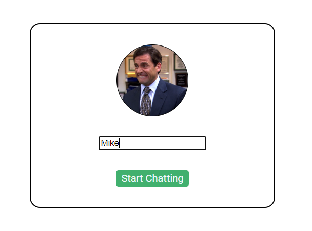
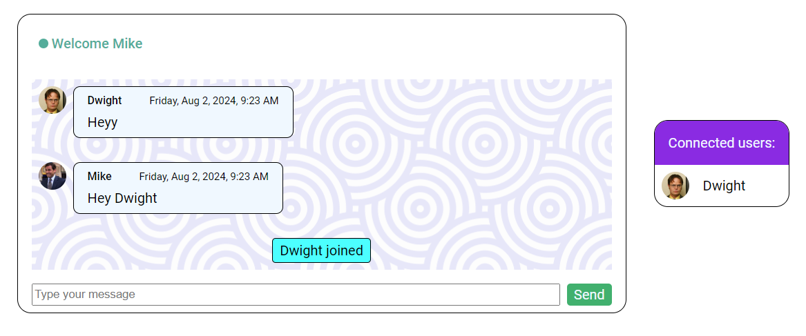
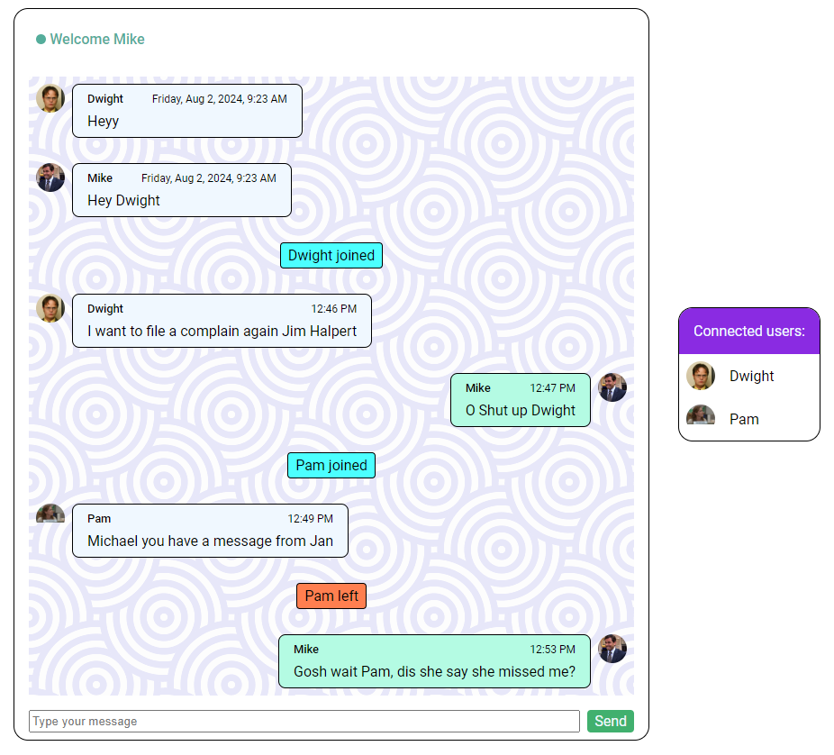

# Socket.io-Chatting-App

The aim of the ChatterUp project is to create an interactive real-time chat application, facilitating seamless communication and interaction between users. This application is built using Node.js, ExpressJS, Socket.io, and MongoDB to provide a robust and engaging chat experience.

# Features

## Socket-Based Architecture

The ChatterUp application will utilize the power of WebSockets through the Socket.io library, enabling real-time, bidirectional communication between users.

## Code Modularity

The project will follow modern development practices by employing ES6 Modules for code organization, ensuring maintainability, and making it easier for developers to collaborate.

## User-Friendly Chat UI

The chat user interface will be carefully designed to enhance the user experience. It will be created using a combination of HTML, CSS, and JavaScript or any modern front-end framework such as React or Angular. The UI will feature components for seamless chatting and a notification panel displaying online users.

## User Onboarding

When a user joins ChatterUp 
for the first time, they will be prompted to provide their name, and a warm welcome message will be displayed in the header with their name.

## Chat History and User Count

Newly joined users will have access to the chat history, enabling them to catch up on previous conversations. Users will also receive real-time information about how many others have already joined the chat.

## Broadcasting Messages and Database Storage

Messages sent by users will be broadcasted to all connected users in real-time. Simultaneously, these messages will be securely stored in the database for future reference and retrieval.

##  User Typing Indicators

As users type messages, a 'typing...' indicator will be displayed to all connected users, indicating which user is currently typing. The indicator will disappear once the user finishes typing or clicks outside the input box.

## Notification of New User Joins

When a new user joins the application, their name will be added to the notification panel, marked with an online symbol (a green dot). All connected users will be notified of this addition, fostering a sense of community.

## Notification of User Disconnections

Whenever a user leaves the application, the notification panel will be updated to reflect the remaining connected users, and the name of the disconnected user will be removed.

## Profile Pictures for User Consistency

Each user will have an associated profile picture displayed throughout their conversation, providing a consistent visual identity for users.

## Displaying Chat Messages

For a comprehensive chat experience, chat messages will display the user's name, profile picture, message content, and the time of posting. This information will be visible to all connected users.
